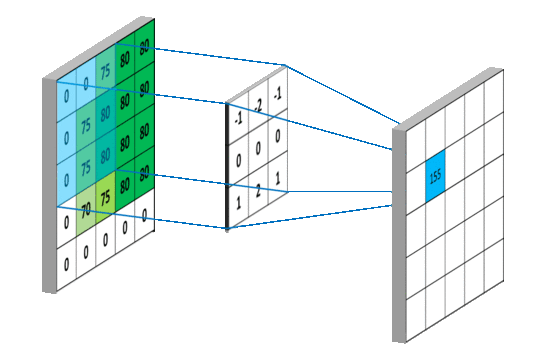

# Conv2D

The `Conv2D`{lang=java} node represents the convolutional layer, which is primarly used for processing images. It tries to learn features from the input images (e.g, lines or corners). Chaining multiple convolutional layers together enables to learn more complex features (e.g., shapes or faces).

The image belows shows how a convolutional layer work. On the left is the input image. The middle is the so called **kernel** and on the right is the output image that contains the features:

The kernel has a size of $3\times3$ pixels that slides over the image. For each pixel the value on the image and on the kernel are multiplied and added to create a combined value. Thereby, the center pixel of the kernel is the resulting position on the output image.
The **stride** values define how many pixels the kernel should move with each step in the vertical and horizontal direction on the image.

The shown example added additional zero pixels around the image. This is called **padding**. Padding is used to ensure that the output dimension of the image is the same as the input image. If no padding is added the output image can be smaller, as always the center of the kernel is used and the border pixels of the input image are never in the center

---

## Node Parameters

### `Filters`{lang=java}

Defines how many kernels (filters) should be used simultaneously.

### `Kernel`{lang=java}

Defines the size of each kernel. Normally, only symmetric kernels are used, e.g. $3 \times 3$ or $5 \times 5$.

### `Stride`{lang=java}

Defines how many pixels the kernel should in each step for every direction. Normally, these values are equal in both directions.

### `Padding`{lang=java}

Can either be `None`{lang=java}, where no padding is used and the output image can have different dimensions as the input image, or `Same`{lang=java}, where the input and output image dimensions are the same.

### `Activation`{lang=java}

The activation function is applied after the convolution operation. Generally `ReLU`{lang=java} is the best fitting function.

---

**Additional information:**

- https://en.wikipedia.org/wiki/Convolutional_neural_network
- https://en.wikipedia.org/wiki/Convolution
- https://pytorch.org/docs/stable/generated/torch.nn.Conv2d.html
